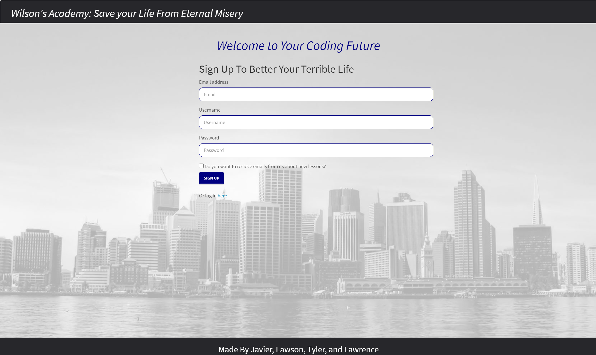

# A streaming platform for web developers.
  
  # Table of Contents
1. [Description](#description)
2. [Installation](#installation)
3. [Usage](#usage)
4. [Contributing](#contributing)
5. [Tests](#tests)
6. [License](#license)
7. [Questions](#questions)
## Description
* That is a streaming platform for web developers. Where they can sign up and watch video tutorials comment and share them with other developers. This is one of the kind and much promising site. 
## Installation
* Just use your preferred browser. 
## Usage
* For daily usage. 
## Screenshot

## Contributing
* When contributing to this repository, please first discuss the change you wish to make via issue, email, or any other method with the owners of this repository before making a change. Please note we have a code of conduct, please follow it in all your interactions with the project.
## Link to deployed version of the app
* https://ancient-bayou-98985.herokuapp.com/
## License
* A short and simple permissive license with conditions only requiring preservation of copyright and license notices. Licensed works, modifications, and larger works may be distributed under different terms and without source code.
## Questions
* Contact us at:
  * [My GitHub Profile](https://github.com/jcaro1993)
  * [My GitHub Profile](https://github.com/Juzva8)
  * [My GitHub Profile](https://github.com/tylerdahl123)
  * [My GitHub Profile](https://github.com/wlawsonkelly)

